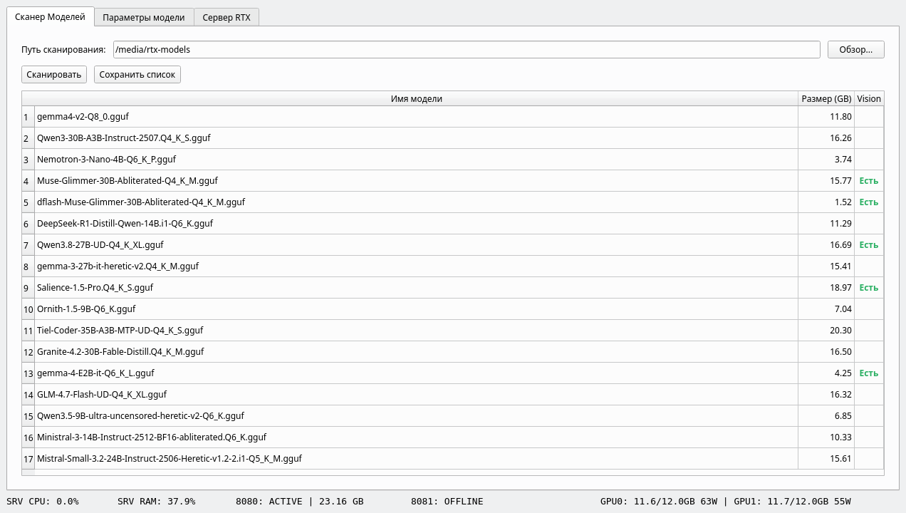
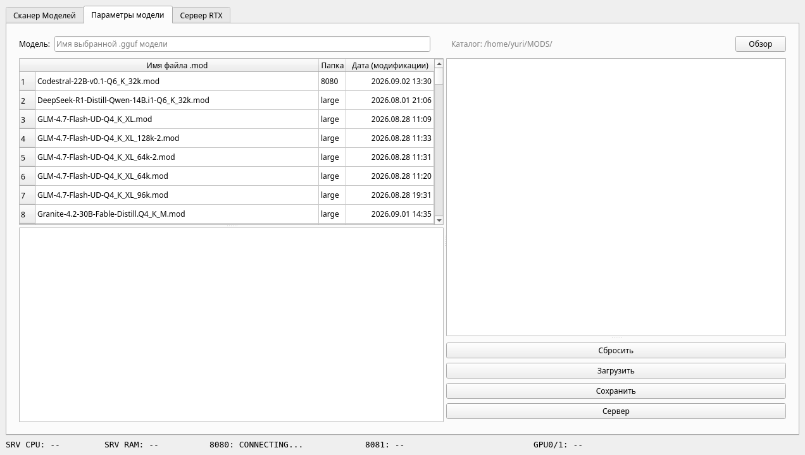
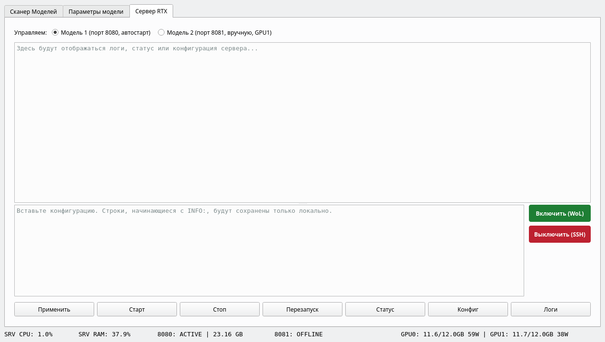

# LLM-Control v2

A **Python / PySide6** desktop app for managing a local `llama-server` LLM
instance running on a remote NVIDIA RTX GPU server.

This project **complements [ContextExporter](https://github.com/YGanchar/ContextExporter)**:
where `ContextExporter` prepares and exports context, `LLM-Control v2` handles the
launch and monitoring of the model itself on the hardware — scanning models,
building the `.mod` configuration, and remotely managing instances over SSH.

> **Baked for** the `Tiel-Coder-35B-A3B-MTP` (Ornith-1.5-35B-A3B) model at
> `Q4_K_S` quantization across two RTX 3060 (12 GB) with speculative decoding via
> the MTP head (`--spec-type draft-mtp`). Everything else is tunable to any
> `.gguf` model.

> **Russian version** — [`README_RU.md`](README_RU.md).

---

## Features

- **Model scanner** — finds `.gguf` files on disk, table with size and a vision flag.
- **`.mod` configurator** — create and edit launch presets for `llama-server`, with
  automatic `CTX`/`NGL`/`BATCH` selection based on model size, quantization, and VRAM capacity.
- **Server control** — start/stop/restart instances (ports 8080 and 8081) over SSH,
  Wake-on-LAN, config validation before saving.
- **Real-time monitoring** — server CPU/RAM, VRAM and power draw per GPU, instance
  status (refreshes every 2 s).

## Architecture

```
LLM-Control-v2/
├── main.py                 # Entry point (.env loading, GUI startup)
├── main_ui.py              # Main window (widget coordination)
├── scanner_widget.py       # Model-scanning widget
├── config_widget.py        # .mod-config widget
├── server_widget.py        # Server control and monitoring widget
├── model_layers.json       # Model-size → n_layer mapping
├── requirements.txt        # Python dependencies
├── services/
│   ├── model_scanner.py    # Filesystem scanning
│   ├── system_monitor.py   # Server monitoring over SSH
│   ├── server_control.py   # llama-server process control
│   ├── ssh_manager.py      # Shared SSH access: key lookup, arg assembly
│   ├── mod_generator.py    # .mod-file generator
│   └── ssh_setup.py        # SSH-access setup wizard
├── server/                 # Server deployment (llmctl, systemd, deploy script)
├── docs/                   # Guides (DEPLOYMENT, llama-server installation, MODES, etc.)
└── dist/                   # PyInstaller artifact (not committed to git)
```

## Requirements

- **OS:** Linux (Ubuntu 20.04+)
- **Python:** 3.8+
- **GPU:** NVIDIA RTX (drivers + CUDA)
- **Network:** SSH access to the server (passwordless, key-based)

## Installation

```bash
pip install -r requirements.txt
python main.py
```

Dependencies: `PySide6`, `paramiko`, `psutil`, `python-dotenv` (+ optional `wakeonlan`).

## Configuration

The app reads `.env` from the project root. Copy the template and fill it in:

```bash
cp .env.example .env
```

Key parameters:

| Parameter | Purpose |
|-----------|---------|
| `LAST_SCAN_PATH` | Folder with `.gguf` models on the client |
| `LAST_MODS_PATH` | Folder with `.mod` presets |
| `SSH_HOST` / `SERVER_HOST` | Server host and IP |
| `SERVER_USER` / `SERVER_MAC` | User and MAC for SSH / Wake-on-LAN |
| `DEFAULT_CONFIG_PATH` | Path to the 8080 instance `.conf` preset on the server |
| `GPU_RAM_GB` | VRAM capacity of one card (for parameter selection) |

Authentication is **key-based only** (`ed25519` without passphrase recommended).
Passwords are not supported.

## Usage

1. **Model scanner** — pick a directory with `.gguf`, scan, double-click a row.
2. **Model parameters** — pick/edit a `.mod` (`MODEL`, `PORT`, `CTX`, `NGL`,
   `BATCH`, `THREADS`, `EXTRA`), save, then go to the server.
3. **RTX server** — pick an instance (8080 / 8081), start/stop/restart, view
   status/logs, power on via WoL / off via SSH.

Full step-by-step guide — in [`docs/USAGE.md`](docs/USAGE.md).
(Russian version — [`docs/ИНСТРУКЦИЯ.md`](docs/ИНСТРУКЦИЯ.md).)

## Screenshots

Model scanner (tab 1):



Model parameters — a `.mod` preset (tab 2):



Server control and GPU monitoring (tab 3):



## Server deployment

Install `llama-server` and `llmctl`, configure `sudoers` and NFS — automated by
`server/deploy-server.sh`. Full guide (server + client) — in
[`docs/DEPLOYMENT.md`](docs/DEPLOYMENT.md).
(Russian version — [`docs/РАЗВЁРТЫВАНИЕ.md`](docs/РАЗВЁРТЫВАНИЕ.md).)

## Building (PyInstaller)

```bash
pyinstaller --onefile --noconsole --name LLM-Control_v2 main.py
```

The artifact lands in `dist/` (not committed to the repo).

## License

[GPL-3.0](LICENSE). Distributed "as is"; redistributed modified versions must
carry the same GPL-3.0 license.

## Related projects

- **[ContextExporter](https://github.com/YGanchar/ContextExporter)** — prepares and
  exports context; works with LLM-Control v2 in a local-LLM pipeline.
